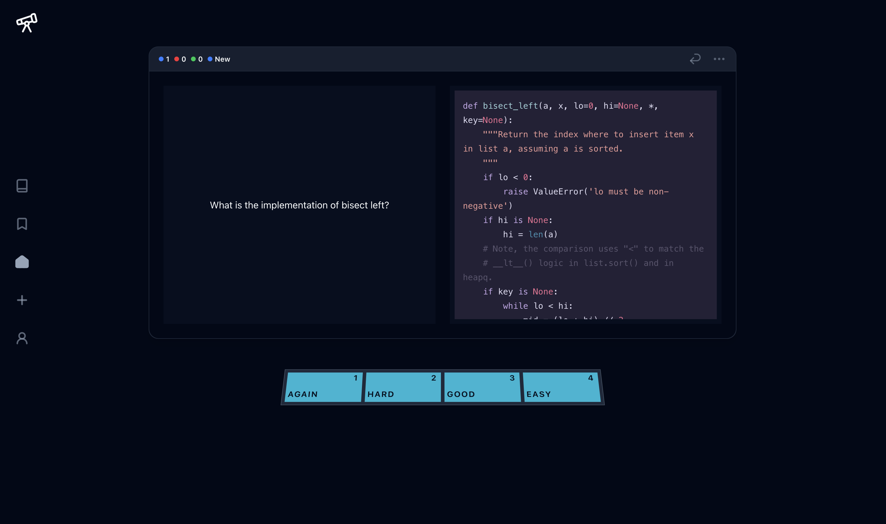
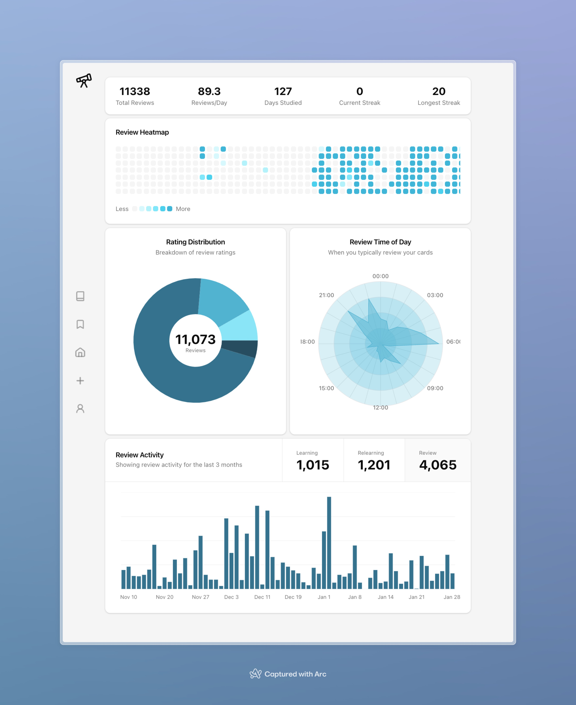

# Spaced

## What is this?

Spaced is a modern flashcard application that uses the Free Spaced Repetition Scheduler (FSRS) algorithm to help you learn efficiently. It's designed to be fast, offline-capable, easy to use, and visually appealing.



### Features

- 📱 **Progressive Web App** - Works offline and can be installed on your device
- ⚡ **Fast and Responsive** - Local-first means the UI is fast and responsive
- 🔄 **Sync Across Devices** - Review cards on desktop or mobile with automatic sync
- 📊 **Rich Statistics** - Track your learning progress with detailed analytics
- 💻 **Modern UI** - Clean, intuitive interface built with shadcn/ui

### Mobile

<p align="center">
  
</p>

### Stats



### Note

The sections below are still being updated.

### Differences from spaced

The main differences between this version of spaced and the original are speed and performance.

#### Reason 1: Speed

Next.js + Vercel -> Vite + Cloudflare pages

TTFB and First Contentful Paint is very slow on Vercel because the serverless functions are slow to start up.

The startup time for cloudflare workers is much lower.
By making this application a Progressive Web App and local-first,
I can use the app offline.

#### Reason 2: Performance and Complexity

An offline-first architecture is used to handle the flashcards.

When everything is maintained on the server, the logic for fetching flashcards is more complex as we have to handle the ordering of the next flashcards to review and limit the results to reduce the packet size being sent over.

By keeping all the flashcards on the client, we simplify the logic for showing the next flashcard to the user.

It also allows for the ability to easily construct alternative UIs for the flashcards,
such as infinite scrolling.

**Doesn't offline-first require synchronisation which increases complexity?**

Not necessarily.
For a flashcard application, the consistency guarantees are less stringent.

If the data is _not synced_, the drawback is just showing the same flashcard to the user more than once (e.g. on mobile and desktop).
See below for ideas on "skipping" cards that have been reviewed but not synced yet.

It's okay if newly created flashcards are not synced to the current device yet, as we can still review the new cards later.

Most cards don't change frequently (especially the card content),
so it makes sense to keep the cards locally and avoid having to use the network bandwidth to fetch the card each time the user opens the app.

## Synchronisation Strategy

The sync strategy for cards is modelled using **CRDTs**.

CRDTs enable eventual consistency between the multiple local clients that exist.

The "server" applies the operations / state updates just like a peer,
but with a few differences:

1. Server uses a SQL relational model instead of the client's NoSQL IndexedDB.

   _Reason_: SQL is faster for querying, sorting and filtering the data.

2. Server maintains a global sequence number for each user to more easily sync updates
   from server to client.
   Clients can just send their last seen sequence number and
   the server can send all updates from that sequence number onwards.

## Assumptions

1. Operations from a _single client_ are ordered.

   Example: if a client creates a card, then updates it, the update operation
   will always be synced to the server before the create operation.

2. Operations from _different clients_ are not ordered.
   1. Client 1 may create a card at time `t1` but is not connected to the Internet.
   2. Client 2 creates a card at time `t2` and syncs to the server.
   3. Client 1 reconnects.
   4. Client 2's card will be synced to the server first and
      then Client 1's card will be synced.
3. Duplicate operations / state sent are ignored.

What does this mean for our CRDTs?

It means that whether we use operation or state-based CRDTs,
we need to ensure that the `merge` operation is
idempotent and commutative
(not just for concurrent operations, but all operations).

## CRDTs Used

### Card Details: LWW Register

Each card ID is associated with a Last-Write-Wins Register.

Each operation is sent with a timestamp (we trust client timestamps).
We merge the value if the timestamp is greater than the current value for that card ID.

### Card Content: LWW Register

Each card's contents are associated with a _different_ Last-Write-Wins Register,
to ensure that edits to the card content don't conflict with rating the card.

### Decks: Causal-Length Set (CLSet)

Decks can be modelled as a many-to-many relationship between a card ID and a deck ID.

Each card can only be added to a deck once,
hence the semantics of a set are appropriate for this use case.

**Why not use a OR-Set?**

An OR-Set stores more metadata than a CLSet.
It stores at least 1 tag (ID) per element, whereas a CLSet just stores a single number
for each element.

## Implementation Details

### Data Schema

A simple implementation is as follows:

```sql
CREATE TABLE users (
  id TEXT PRIMARY KEY,
  last_modified DEFAULT CURRENT_TIMESTAMP NOT NULL,
  username TEXT NOT NULL,
  email TEXT NOT NULL,
  password_hash TEXT NOT NULL,
  next_seq_no INTEGER NOT NULL DEFAULT 1,
    -- Other user fields
);

CREATE TABLE clients (
  id TEXT PRIMARY KEY,
  last_modified DEFAULT CURRENT_TIMESTAMP NOT NULL,
  user_id TEXT NOT NULL,
  UNIQUE(user_id, id),

  -- Other metadata about client
);

CREATE TABLE cards (
  id TEXT PRIMARY KEY,
  last_modified DEFAULT CURRENT_TIMESTAMP NOT NULL,
  seq_no INTEGER NOT NULL,
  user_id TEXT NOT NULL,
  last_modified_client TEXT NOT NULL,
  -- Other card fields
  FOREIGN KEY (user_id) REFERENCES users(id)
  FOREIGN KEY (last_modified_client) REFERENCES clients(id)
);

CREATE TABLE card_contents (
  card_id TEXT PRIMARY KEY,
  front TEXT NOT NULL,
  back TEXT NOT NULL,
  last_modified DEFAULT CURRENT_TIMESTAMP NOT NULL,
  seq_no INTEGER NOT NULL,
  last_modified_client TEXT NOT NULL,
  -- Other card content fields
  FOREIGN KEY (card_id) REFERENCES cards(id)
  FOREIGN KEY (last_modified_client) REFERENCES clients(id)
);

CREATE TABLE card_deleted (
  card_id TEXT PRIMARY KEY,
  last_modified DEFAULT CURRENT_TIMESTAMP NOT NULL,
  seq_no INTEGER NOT NULL
  FOREIGN KEY (card_id) REFERENCES cards(id)
  FOREIGN KEY (last_modified_client) REFERENCES clients(id)
);

CREATE TABLE decks (
  id TEXT PRIMARY KEY,
  last_modified DEFAULT CURRENT_TIMESTAMP NOT NULL,
  seq_no INTEGER NOT NULL
  deleted BOOLEAN NOT NULL DEFAULT FALSE,
  user_id TEXT NOT NULL,
  last_modified_client TEXT NOT NULL,
  FOREIGN KEY (user_id) REFERENCES users(id)
  FOREIGN KEY (last_modified_client) REFERENCES clients(id)
);

CREATE TABLE card_decks (
  card_id TEXT NOT NULL,
  deck_id TEXT NOT NULL,
  last_modified DEFAULT CURRENT_TIMESTAMP NOT NULL,
  seq_no INTEGER NOT NULL,
  cl_count INTEGER NOT NULL DEFAULT 0,

  user_id TEXT NOT NULL,

  PRIMARY KEY (card_id, deck_id),
  FOREIGN KEY (card_id) REFERENCES cards(id),
  FOREIGN KEY (deck_id) REFERENCES decks(id)
  FOREIGN KEY (user_id) REFERENCES users(id)
);
```

### Client Operations

The client operations are:

- Create a card -> 2 operations: create a card, create card content, delete card
- Update a card's contents
- Delete a card
- Rate a card (update card)
- Create a deck
- Add a card to a deck
- Remove a card from a deck

Whenever the client takes any of these actions, it persists the write to IndexedDB
and writes the operation to the `pendingOperations` table.

Syncing is done by first pulling the latest operations from the server
and then sending the client's pending operations to the server.

The server replies with the IDs of the operations successfully processed
(does not necessarily update the value).

Operations are always written to the `pendingOperations` table first,
and are synchronised in the background.

### Server Operations

When the server receives an operation, it first checks if the operation is valid.

Example: for LWW Register, it checks if the timestamp is greater than the current timestamp.
If there is a tie in the timestamp, we use the client ID to break the tie.

If the operation is not valid, it is not applied but the server still responds.

If the operation is valid, the server grabs the next sequence number for that user,
increments it and applies the operation.

## Other Features

- Cache image content locally (indefinite caching) by extracting the
  image URLs from the flashcard content.
- Infinite scroll UI for flashcards.
