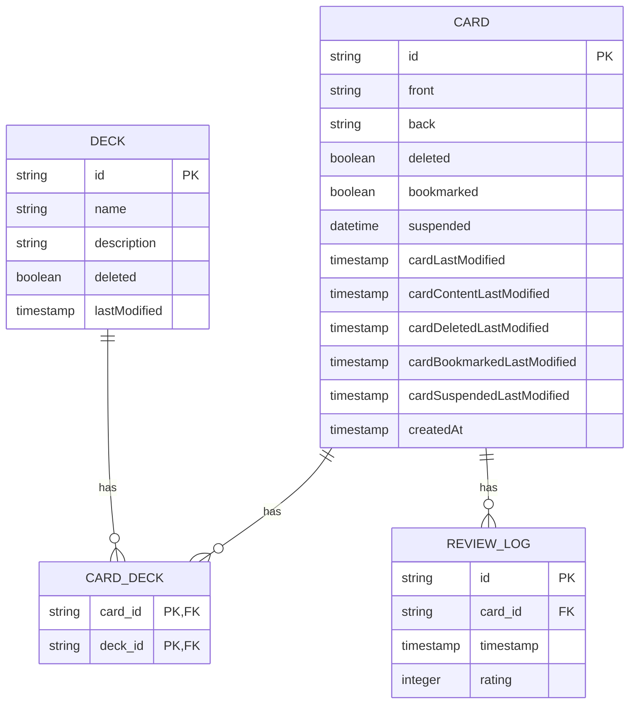

# Spaced: Project Overview

## 1. Project Introduction

Spaced is a modern flashcard application designed for efficient learning through spaced repetition. It utilizes the Free Spaced Repetition Scheduler (FSRS) algorithm to optimize study schedules. The application is built as a Progressive Web App (PWA), ensuring it is installable on both desktop and mobile devices and can function offline.

### Key Features:

*   **Offline-First**: The application is designed to be local-first, meaning all data is stored on the client-side, making the UI fast and responsive.
*   **Cross-Device Sync**: Spaced supports automatic synchronization across multiple devices, allowing users to review their flashcards on either desktop or mobile.
*   **Rich Statistics**: The application provides detailed analytics and visualizations to help users track their learning progress.
*   **Modern UI**: Spaced features a clean, intuitive, and visually appealing user interface.

## 2. Design Highlights

The design of Spaced is centered around performance, simplicity, and a seamless user experience. The following are the key design highlights:

*   **Technology Stack**: The application is built with a modern technology stack, including:
    *   **Frontend**: React and TypeScript, built with Vite for a fast development experience.
    *   **Deployment**: Cloudflare Pages for fast global delivery and low-latency serverless functions.
    *   **UI Components**: Shadcn UI for a set of accessible and composable UI components.
    *   **Database**: Dexie.js for a wrapper around IndexedDB, enabling a robust offline-first experience.

*   **Offline-First Architecture**: By storing all flashcards on the client, the application simplifies the logic for fetching and displaying cards. This approach also allows for more complex UI features, such as full-text search and advanced statistics, without relying on a server.

*   **CRDT-Based Synchronization**: To handle data consistency across multiple devices, Spaced uses Conflict-free Replicated Data Types (CRDTs). This allows for an eventual consistency model, which is well-suited for a flashcard application where strict consistency is not a primary requirement. The synchronization mechanism is designed to be robust and efficient, using a combination of Last-Write-Wins (LWW) registers and Grow-Only Sets.

*   **Decoupled Client and Server**: The client and server are decoupled, with the server acting as a peer that applies operations from clients. The server uses a relational SQL model for efficient querying, while the client uses a NoSQL model (IndexedDB) for simplicity and performance.

## 3. Data Entity Relationship Diagram

The following diagram illustrates the main data entities and their relationships within the Spaced application.



## 4. Application Flowchart

This flowchart illustrates the main user flow and data synchronization process in the Spaced application.

```mermaid
graph TD
    subgraph User Actions
        A[Start Application] --> B{User is Logged In?};
        B -- Yes --> C[View Decks];
        B -- No --> D[Login/Register];
        D --> C;
        C --> E{Select a Deck};
        E -- Deck Selected --> F[Review Flashcards];
        F --> G{Rate a Card};
        G -- Rated --> H[Update Card and Create Review Log];
        H --> F;
        C --> I[Create New Card];
        I --> J[Save Card to Local DB];
        J --> C;
    end

    subgraph Synchronization
        K[Local DB (IndexedDB)] -- Operations --> L(Pending Operations Queue);
        L -- Sync Trigger --> M[Sync Engine];
        M -- GET /api/sync --> N[Server];
        N -- Operations --> M;
        M -- POST /api/sync --> N;
        M -- Updates --> K;
    end

    J --> L;
    H --> L;
```
